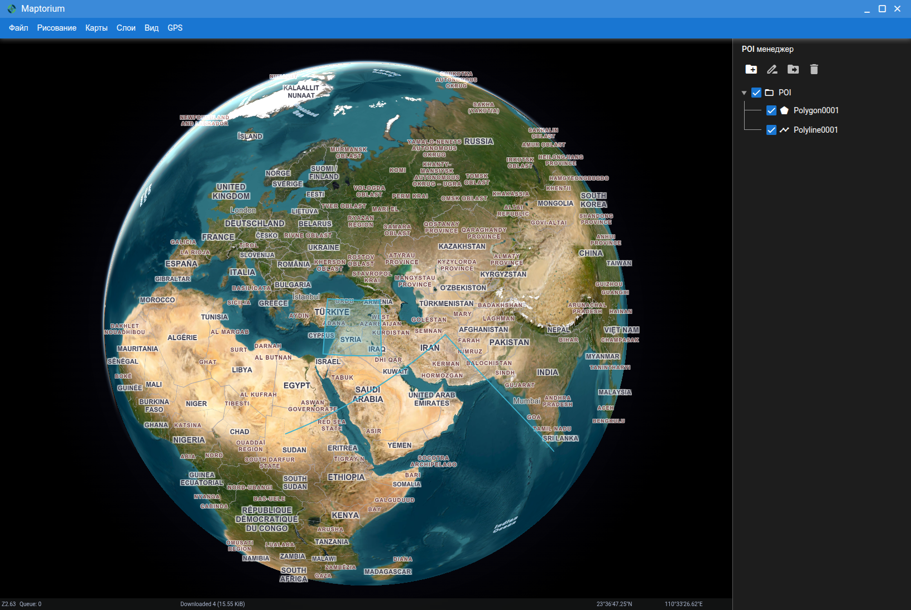

# maptorium-server 4.0.0

Maptorium 4.0 is available now. Complete new UI with vector support and other improvements. The server is Electron-ready and can be packaged into desktop applications (AppImage / portable Windows builds).



Latest Chrome is highly recommended for Maptorium UI and WebGL support

[Join Telegram Groupe to contribute or ask questions](https://t.me/maptorium)

### Description

This is HTTP + Socket. IO API Server what can do next:

1. Make each tile cache to use such cache offline.
   - Support for rasterized tiles (JPEG/PNG).
   - Support for vector tiles (MapBox, ArcGis, Maptorium).
   - All other types that can be rendered by UI.
   - Cache DB is fully compatible with [SAS Planet](https://sasgis.org) sqlite storage.
2. Records GPS routes from various sources.
   - Custom GPS HTML server[^1].
   - TCP NMEA Server.
3. POI storage: POI are no longer stored on the server DB — POI (points, polylines, polygons) are now stored on the client side in persistent storage.
4. Perform mass downloads of tiles with range options.
   - HTTP/HTTPS/Socks support
   - TOR get support including New ID.
   - Various options to check tile age, status and so on.
5. Generate upper zoom levels from downloaded tiles.
6. Creates cached map information (information about missed/downloaded/empty tiles) for the selected area.
7. Supports next maps out of the box:
   - ArcGis Elevation (gridded)
   - ArcGis Satelite (rasterized)
   - ArcGis Vector as hybrid overlay (vector)
   - Google Satelite (rasterized)
   - Google Hybrid Ru Version (rasterized)
   - Google Hybrid Eng Version (rasterized)
   - MapBox as hybrid overlay (vector)
   - MapBox Terraine (rasterized)
   - OSM (rasterized)
   - OSM Marine as overlay.
   - Yandex Satelite (rasterized)
   - Yandex Hybrid (rasterized)
   - Any other map you can think of and add.

This is a part of Maptorium project. Must work with
Maptorium HTML UI to have all these features available.

### Installation

#### Linux/Windows users

You must have at least version 16 of NodeJS installed in the system to run this server.

This installation is suitable for development purposes. If you look for 'ready for use' code, see `Pre Compiled code` section

```
git clone https://github.com/gunyakov/maptorium-server.git

cd maptorium-server

npm install

npm run start
```

<details>

<summary>SQLite3 module compilation error</summary>

If you have problems compiling the SQLite3 module, run the following command

```
npm install https://github.com/mapbox/node-sqlite3/tarball/master
```

</details>

#### Pre Compiled code

Project is write with Type Script. If you don't want to compile server and UI code into JS, you can download precompiled code from release section [here](https://github.com/gunyakov/maptorium-server/releases/tag/v3.0.0)

Unpack archive, run `npm i` inside server folder and enjoy.

#### Windows lazy users

For Windows users, the portable version v3.0.0-win-x64 with UI is available. You can download it [here](https://github.com/gunyakov/maptorium-server/releases/tag/v3.0.0)

#### Prebuilt / Releases

Prebuilt releases are available for this version (v4.0.0). See the releases page for AppImage or Windows portable builds:

- Releases: https://github.com/gunyakov/maptorium-server/releases/tag/v4.0.0

#### Building Electron App (Linux / Windows)

Prerequisites:

- Node.js >= 16 (LTS recommended)
- System build tools for native modules (on Debian/Ubuntu: `build-essential`, `python3`, `pkg-config`, `libsqlite3-dev`, `libudev-dev`, `libvips-dev`)
- Git

Basic steps to build an Electron desktop package:

1. Clone and install dependencies

```
git clone https://github.com/gunyakov/maptorium-server.git
cd maptorium-server
npm install
```

2. Compile TypeScript to JavaScript

```
npm run build
```

3. Rebuild native modules for Electron (this runs `electron-builder install-app-deps`)

```
npm run rebuild
```

4. Create a packaged Electron application

- Linux AppImage (x64):

```
npm run dist:linux
```

- Windows portable build (creates a portable .exe):

```
npm run dist:win
```

- Build unpacked directory for debugging:

```
npm run pack
```

Outputs are placed in the `dist/` folder by `electron-builder`.

Notes about native modules:

- This project uses native modules such as `better-sqlite3`, `sharp`, and `serialport`. Make sure system dependencies are installed before `npm install`. If you encounter compilation errors, install the required system packages and re-run `npm install` and `npm run rebuild`.
- On some systems you may need to remove `node_modules` and re-run `npm install` after installing system packages.

Development run (no packaging):

```
npm install
npm run start
```

### POI migration / export

POI are migrated to client-side persistent storage. To move existing POI from the server DB to the client, export them using the built-in export script and then import the resulting backup into the client application.

Export command (creates a .mpb backup file):

```
npm run backup:poi
```

Or run directly with `tsx` (allows `--db` and `--out` flags):

```
npx tsx scripts/export-poi-backup.ts --db ./POI.db3 --out ./maptorium-poi.mpb
```

The export writes a backup file containing folder definitions and a GeoJSON FeatureCollection. Copy the `.mpb` file to the client machine and import it using the Maptorium UI import.

## To do

- [x] COM support of nmea devices for win and linux
- [x] POI Manager (Maptorim 3.0)
- [x] Ability to set all server configurations from the user interface
- [x] Support for multiple languages (maptorium 3.0)
- [x] Electron ready code

[^1]: You need to change the code to get the data from such a server. Open the file `gps/gps_core.ts`, find the function `getGPSCoords()` and implement your logic there.
