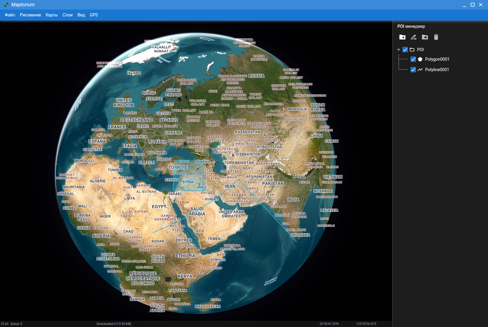

# maptorium-server 4.1.2

Maptorium 4.0 is available now. Complete new UI with vector support and other improvements. The server is Electron-ready and can be packaged into desktop applications (AppImage / portable Windows builds).



Latest Chrome is highly recommended for Maptorium UI and WebGL support

[Join Telegram Groupe to contribute or ask questions](https://t.me/maptorium)

### Description

This is HTTP + Socket. IO API Server what can do next:

1. Make each tile cache to use such cache offline.
   - Support for rasterized tiles (JPEG/PNG).
   - Support for vector tiles (MapBox, ArcGis, Maptorium).
   - All other types that can be rendered by UI.
   - Cache DB is fully compatible with [SAS Planet](https://sasgis.org) sqlite storage.
2. Records GPS routes from various sources.
   - Custom GPS HTML server[^1].
   - TCP NMEA Server.
3. POI storage: POI are no longer stored on the server DB — POI (points, polylines, polygons) are now stored on the client side in persistent storage.
4. Perform mass downloads of tiles with range options.
   - HTTP/HTTPS/Socks support
   - TOR get support including New ID.
   - Various options to check tile age, status and so on.
5. Generate upper zoom levels from downloaded tiles.
6. Creates cached map information (information about missed/downloaded/empty tiles) for the selected area.
7. Supports next maps out of the box:
   - ArcGis Elevation (gridded)
   - ArcGis Satelite (rasterized)
   - ArcGis Vector as hybrid overlay (vector)
   - Google Satelite (rasterized)
   - Google Hybrid Ru Version (rasterized)
   - Google Hybrid Eng Version (rasterized)
   - MapBox as hybrid overlay (vector)
   - MapBox Terraine (rasterized)
   - OSM (rasterized)
   - OSM Marine as overlay.
   - Yandex Satelite (rasterized)
   - Yandex Hybrid (rasterized)
   - Any other map you can think of and add.

This is a part of Maptorium project. Must work with
Maptorium HTML UI to have all these features available.

### Releases

Precompiled builds (Windows installer, Linux AppImage) are published on the [Releases page](https://github.com/gunyakov/maptorium-server/releases/tag/v4.1.2).

### Build for Windows

See [BUILD.md — Building for Windows](./BUILD.md#building-for-windows) for full step-by-step instructions.

### Build for Linux

See [BUILD.md — Building for Linux](./BUILD.md#building-for-linux) for full step-by-step instructions.

### POI migration / export

POI are migrated to client-side persistent storage. To move existing POI from the server DB to the client, export them using the built-in export script and then import the resulting backup into the client application.

Export command (creates a .mpb backup file):

```
npm run backup:poi
```

Or run directly with `tsx` (allows `--db` and `--out` flags):

```
npx tsx scripts/export-poi-backup.ts --db ./POI.db3 --out ./maptorium-poi.mpb
```

The export writes a backup file containing folder definitions and a GeoJSON FeatureCollection. Copy the `.mpb` file to the client machine and import it using the Maptorium UI import.

## To do

- [x] COM support of nmea devices for win and linux
- [x] POI Manager (Maptorim 3.0)
- [x] Ability to set all server configurations from the user interface
- [x] Support for multiple languages (maptorium 3.0)
- [x] Electron ready code

[^1]: You need to change the code to get the data from such a server. Open the file `gps/gps_core.ts`, find the function `getGPSCoords()` and implement your logic there.
