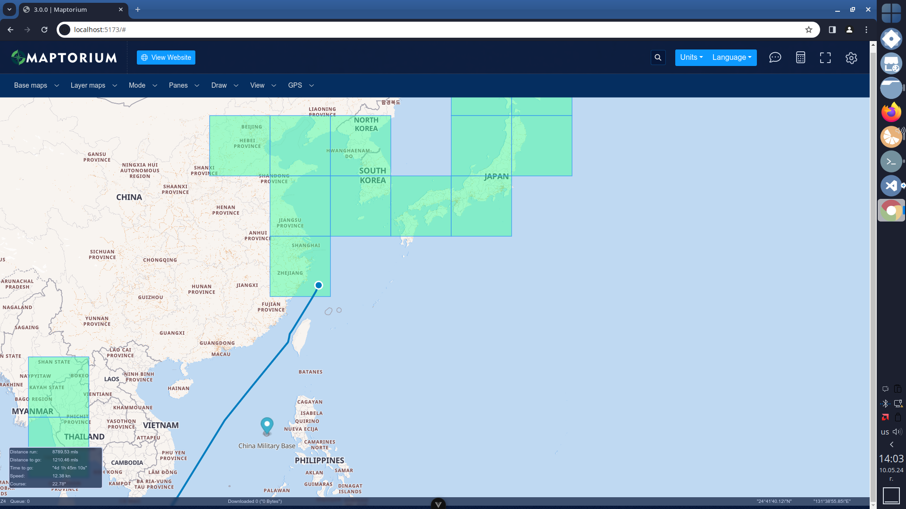

# maptorium-server 3.0.0

Maptorium 3.0 is available now. Complete new UI with vector map supports and other improvements.



Latest Chrome is highly recommended for Maptorium UI and WebGL support

[Join Telegram Groupe to contribute or ask questions](https://t.me/maptorium)

### Description

This is HTTP + Socket. IO API Server what can do next:

1. Make each tile cache to use such cache offline.
   - Support for rasterized tiles (JPEG/PNG).
   - Support for vector tiles (MapBox, ArcGis, Maptorium).
   - All other types that can be rendered by UI.
   - Cache DB is fully compatible with [SAS Planet](https://sasgis.org) sqlite storage.
2. Records GPS routes from various sources.
   - Custom GPS HTML server[^1].
   - TCP NMEA Server.
3. Storage of POI (polyline, polygon, point) in DB.
4. Perform mass downloads of tiles with range options.
   - HTTP/HTTPS/Socks support
   - TOR get support including New ID.
   - Various options to check tile age, status and so on.
5. Generate upper zoom levels from downloaded tiles.
6. Creates cached map information (information about missed/downloaded/empty tiles) for the selected area.
7. Supports next maps out of the box:
   - ArcGis Elevation (gridded)
   - ArcGis Satelite (rasterized)
   - ArcGis Vector as hybrid overlay (vector)
   - Google Satelite (rasterized)
   - Google Hybrid Ru Version (rasterized)
   - Google Hybrid Eng Version (rasterized)
   - MapBox as hybrid overlay (vector)
   - MapBox Terraine (rasterized)
   - OSM (rasterized)
   - OSM Marine as overlay.
   - Yandex Satelite (rasterized)
   - Yandex Hybrid (rasterized)
   - Any other map you can think of and add.

This is a part of Maptorium project. Must work with
Maptorium HTML UI to have all these features available.

### Installation

#### Linux/Windows users

You must have at least version 16 of NodeJS installed in the system to run this server.

This installation is suitable for development purposes. If you look for 'ready for use' code, see `Pre Compiled code` section

```
git clone https://github.com/gunyakov/maptorium-server.git

cd maptorium-server

npm install

npm run start
```

<details>

<summary>SQLite3 module compilation error</summary>

If you have problems compiling the SQLite3 module, run the following command

```
npm install https://github.com/mapbox/node-sqlite3/tarball/master
```

</details>

#### Pre Compiled code

Project is write with Type Script. If you don't want to compile server and UI code into JS, you can download precompiled code from release section [here](https://github.com/gunyakov/maptorium-server/releases/tag/v3.0.0)

Unpack archive, run `npm i` inside server folder and enjoy.

#### Windows lazy users

For Windows users, the portable version v3.0.0-win-x64 with UI is available. You can download it [here](https://github.com/gunyakov/maptorium-server/releases/tag/v3.0.0)

## To do

- [ ] COM support of nmea devices for win and linux
- [x] POI Manager (Maptorim 3.0)
- [ ] Ability to set all server configurations from the user interface
- [x] Support for multiple languages (maptorium 3.0)

[^1]: You need to change the code to get the data from such a server. Open the file `gps/gps_core.ts`, find the function `getGPSCoords()` and implement your logic there.
